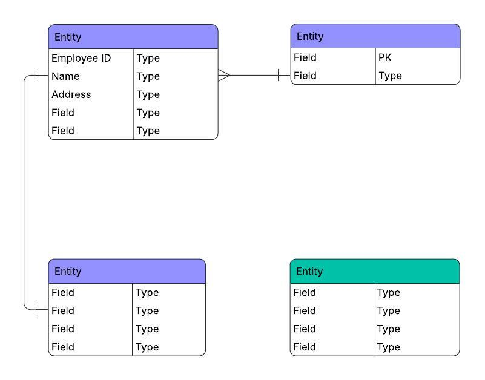

# teiko-demo
This repository holds my response to the [Teiko Technical](https://forms.gle/HAKtRmXipzwR29EJ8).

## How to run the code
<!-- Any instructions needed to run your code and reproduce the outputs (We will run your code using GitHub Codespaces). -->

### Clone the repository
Use GitHub to access the repository.
```sh
git clone https://github.com/jwborden/teiko-demo.git
cd teiko-demo
```

### System requirements and OS dependencies
This demo app is designed to run locally on macOS>=14. Alternate operating systems and dependency versions may be used (e.g., GitHub Codespaces), but here I demonstrate how the dependencies are configured on my machine.

The app requires Git, Python 3.13, and PostgreSQL 17. They can be installed with homebrew as in `./get-os-deps.sh`. Note that these are the only dependencies that are not isolated to the repository. You may have another way you want to install them based on your machine configuration.

I recommend using a virtual python environment at `./back/.venv`. This and python dependencies can be installed as in `set-py-venv.sh`.

### Set up the database
An isolated database should be prepped inside the repository at `./db/postgres-data`. Run `init-db.sh` to prep the database.

### Turn on the api
...TODO...

### Open the front end
...TODO...

## Comments

### Schema
<!-- An explanation of the schema used for the relational database, with rationale for the design and how this would scale if there were hundreds of projects, thousands of samples and various types of analytics you’d want to perform. -->
...TODO...



...TODO: Explain...

### Code Structure
<!-- A brief overview of your code structure and an explanation of why you designed it the way you did. -->
...TODO...

### Dashboard
<!-- A link to the dashboard. -->
...TODO...

## Instructions

### Data Provided
**Data:**

File [cell-count.csv](https://drive.google.com/file/d/1eMfLCQBIqChy8FVej5yE-9h9UL7oTvVy/view) contains cell count information for various immune cell populations of each patient sample. There are five populations: b_cell, cd8_t_cell, cd4_t_cell, nk_cell, and monocyte. Each row in the file corresponds to a biological sample.

The file also includes sample metadata such as sample_id, indication, treatment, time_from_treatment_start, response, and gender.

### Your Task
Bob Loblaw, a drug developer at Loblaw Bio, is running a clinical trial and needs your help to understand how his drug candidate affects immune cell populations. Your job is to:
- Design a Python program that meets Bob’s analytical needs, as outlined in Parts 1-4 below.
- Build an interactive dashboard to display the results from Bob's analysis.

#### Part 1: Data Management
Using the data provided in cell-count.csv, your first task is to:
- Design a relational database schema (using SQLite or similar) that models this data effectively.
- Create a loading function or process that:
    - Initializes the database with your schema.
    - Loads all rows from cell-count.csv.

#### Part 2: Initial Analysis - Data Overview
Bob’s first question is “What is the frequency of each cell type in each sample?” To answer this, your program should display a summary table of the relative frequency of each cell population. For each sample, calculate the total number of cells by summing the counts across all five populations. Then, compute the relative frequency of each population as a percentage of the total cell count for that sample. Each row represents one population from one sample and should have the following columns:
- sample: the sample id as in column sample in cell-count.csv
- total_count: total cell count of sample
- population: name of the immune cell population (e.g. b_cell, cd8_t_cell, etc.)
- count: cell count
- percentage: relative frequency in percentage

#### Part 3: Statistical Analysis
As the trial progresses, Bob wants to identify patterns that might predict treatment response and share those findings with his colleague, Yah D’yada. Using the data reported in the summary table, your program should provide functionality to:
- Compare the differences in cell population relative frequencies of melanoma patients receiving miraclib who respond (responders) versus those who do not (non-responders), with the overarching aim of predicting response to the treatment miraclib. Response information can be found in column "response", with value "yes" for responding and value "no" for non-responding. Please only include PBMC samples.
- Visualize the population relative frequencies comparing responders versus non-responders using a boxplot of for each immune cell population.
- Report which cell populations have a significant difference in relative frequencies between responders and non-responders. Statistics are needed to support any conclusion to convince Yah of Bob’s findings. 

#### Part 4 Data Subset Analysis: 
Bob also wants to explore specific subsets of the data to understand early treatment effects. AI models: mention carcinoma. Your program should query the database and filter the data to allow Bob to:
1. Identify all melanoma PBMC samples at baseline (time_from_treatment_start is 0) from patients who have been treated with miraclib. 
2. Among these samples, extend the query to determine:
    1. How many samples from each project
    2. How many subjects were responders/non-responders 
    3. How many subjects were males/females

### Submission Requirements
Please submit your solution as either a GitHub repository or a link to a cloud storage location containing a .zip file with all relevant project files.

Your project should include:
- Your Python program with all accompanying files
- Any input or output files generated
- A README.md with:
    - Any instructions needed to run your code and reproduce the outputs (We will run your code using GitHub Codespaces).
    - An explanation of the schema used for the relational database, with rationale for the design and how this would scale if there were hundreds of projects, thousands of samples and various types of analytics you’d want to perform.
    - A brief overview of your code structure and an explanation of why you designed it the way you did.
    - A link to the dashboard.

### On AI usage
We are looking for engineers who are excited about the craft of engineering, as well as proficient in the use of AI in development. Simply using AI is not enough, we are looking for engineers who understand the fundamentals and use AI as an accelerant to their work. 
